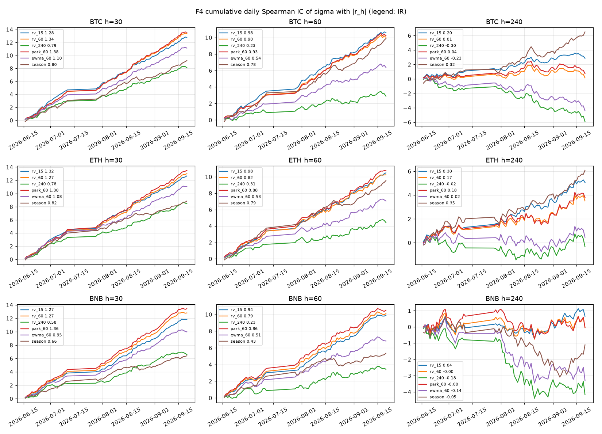
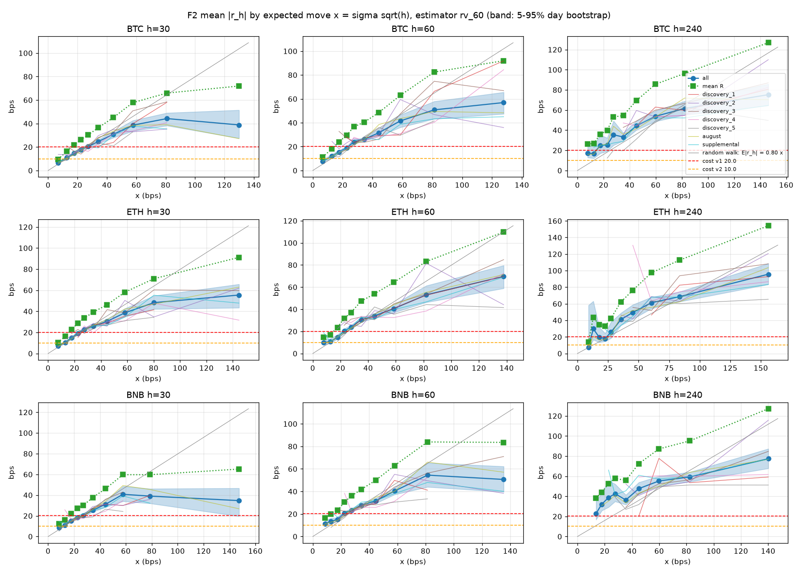
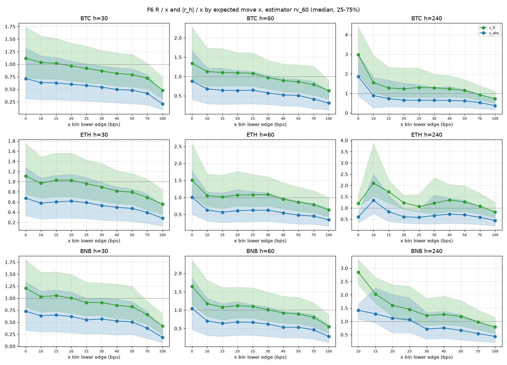
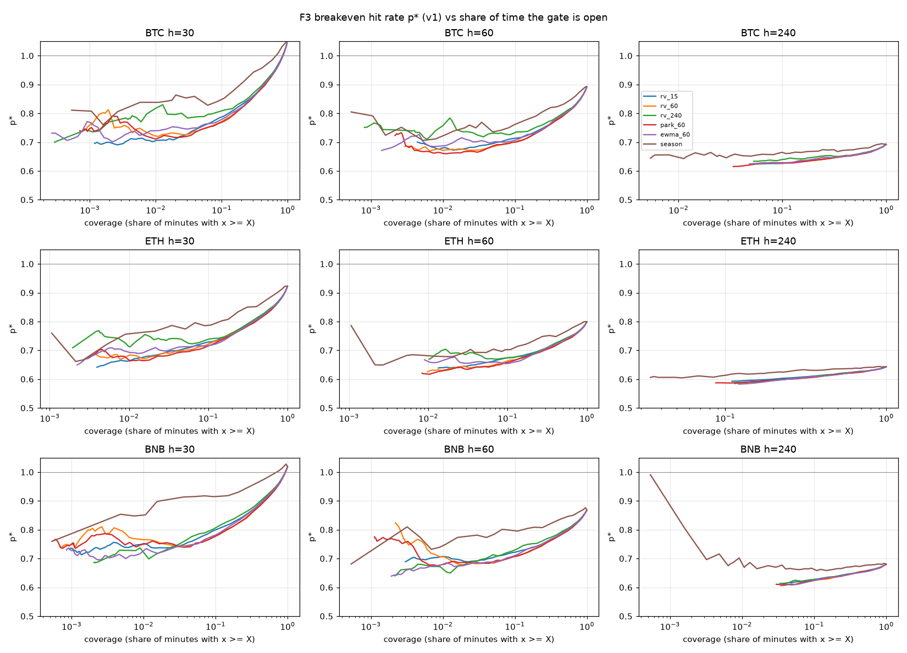
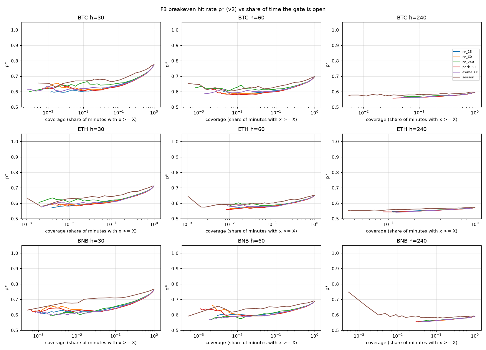

# T09: Volatility State and Forward Excursion

Status: in progress. Run `excursion-v1` is descriptive, with preregistered check
C1 (magnitude) passed and C2 (direction) failed. Run `vol-gate-v1` measures
absolute volatility as a gate for other strategies: rv_60 ranks 30 and 60 min
move size consistently, but at v1 cost a direction signal inside the gate still
needs a 64 to 75% hit rate to break even.

## Question

A2 ([T08](../T08-observation-studies/REPORT.md)) measured large moves with the
return between the start and the end of a fixed window. A trade is closed by
whichever barrier the path reaches first, so this run measures the forward
maximum and minimum within the window instead, grouped by the trailing volatility
state.

## Setup

- Data: BTC, ETH, and BNB spot discovery splits, 51 days per instrument, 6 blocks
  (discovery_1..5 and supplemental). No validation or holdout data.
- State: decile of `rv_60` (trailing 60 min realized volatility) within the
  trailing 7 days. Uses data up to t only, which fixes the full-sample percentile
  used in the A2 conditional table.
- Targets over (t, t+h], h = 30, 60, 240 min, minute-close mid:
  maximum return U, minimum return D, R = max(U, |D|), the minute each barrier is
  first reached, and the end return for comparison.
- Barrier b = 2 x v1 round-trip cost, 40 bps on all three instruments (median
  spread is at most 0.2 bps).
- Main table: non-overlapping samples, one every h minutes. Checks: minute-pooled
  samples with the A2 block rule (same sign in at least 5 of 6 blocks on at least
  2 of 3 instruments).
- Trials: 18 screened cells (C1 and C2, 3 instruments x 3 horizons). The
  descriptive tables cover 6 barriers (1 to 3 x v1 and draft v2 cost) and both
  samplings.

## Results

### Path touches are about twice as frequent as end-of-window moves

Probability that |move| reaches 40 bps, all deciles, non-overlapping samples:

| Instrument | h | Path touch | End of window |
| --- | --- | --- | --- |
| BTC | 30 | 0.19 | 0.11 |
| BTC | 60 | 0.38 | 0.20 |
| BTC | 240 | 0.80 | 0.47 |
| ETH | 30 | 0.30 | 0.17 |
| ETH | 60 | 0.54 | 0.28 |
| ETH | 240 | 0.89 | 0.57 |
| BNB | 30 | 0.22 | 0.12 |
| BNB | 60 | 0.44 | 0.24 |
| BNB | 240 | 0.89 | 0.53 |

A2's end-of-window target understated how often a 40 bps barrier is reached by a
factor of 1.6 to 1.9.

### Volatility state predicts the touch at 30 and 60 minutes

Path touch probability at 40 bps by `rv_60` decile:

| Instrument | h | Decile 1 | Decile 5 | Decile 10 |
| --- | --- | --- | --- | --- |
| BTC | 30 | 0.05 | 0.11 | 0.56 |
| BTC | 60 | 0.13 | 0.25 | 0.73 |
| ETH | 30 | 0.10 | 0.22 | 0.63 |
| ETH | 60 | 0.25 | 0.51 | 0.81 |
| BNB | 30 | 0.07 | 0.19 | 0.53 |
| BNB | 60 | 0.20 | 0.45 | 0.73 |

C1 (deciles 9-10 touch more often than deciles 1-2) passed in all 9 cells: 6 of 6
blocks at 30 min on all instruments, and 5 or 6 of 6 at 60 and 240 min. At 240
min most windows reach 40 bps in every decile (0.56 to 1.00), so the state mainly
changes the time to the touch. Median minutes to first touch, decile 1 against
decile 10, are 84 and 26 (BTC), 50 and 19 (ETH), and 94 and 20 (BNB). The 240 min
deciles hold only 20 to 34 non-overlapping samples each.

### Direction of the first touch is a coin flip

Share of touched windows that reach +40 bps before -40 bps, minute-pooled, deciles
9-10, and the C2 block count:

| Instrument | 30 min | 60 min | 240 min |
| --- | --- | --- | --- |
| BTC | 0.510 (3/6) | 0.490 (4/6) | 0.483 (4/6) |
| ETH | 0.513 (3/6) | 0.505 (3/6) | 0.493 (4/6) |
| BNB | 0.521 (3/6) | 0.516 (3/6) | 0.534 (4/6) |

C2 failed in all 9 cells. In non-overlapping samples the up-first share ranges
from 0.25 to 0.71 across deciles with no monotone pattern.

### Trade high/low gives slightly higher touch rates

Using minute trade high and low instead of minute-close mid raises the touch
probability by 0 to 15 percentage points. Part of that is bid-ask bounce, so the
mid values above are the main estimate.

## Interpretation

High volatility tells when a 40 bps barrier will be reached, and that is stable
across blocks and instruments. It does not tell which side is reached first, so
symmetric barriers entered at t have no gross edge in any state. A tradable rule
needs a second step: what the path does after the first touch.

## Run vol-gate-v1: absolute volatility as a gate

### Question and setup

Can a volatility estimate known at t serve as a gate that opens only when the
next h minutes are likely to move enough to pay the cost? Percentiles are not
used: cost is fixed in bps, so the gate is defined on absolute volatility.

- Data: the six excursion-v1 blocks plus an August discovery supplement
  (2026-07-25 to 2026-08-27), 7 blocks and 79 days per instrument. No validation
  or holdout data.
- Estimators, per-minute volatility sigma in bps from data up to t: rv_15, rv_60,
  rv_240 (std of 1-min log mid returns), park_60 (Parkinson from minute trade
  high/low), ewma_60 (half-life 60 min), and season (median of the same UTC hour
  over the previous 7 days, a pure time-of-day estimate).
- Expected move x = sigma x sqrt(h). Under a random walk, the mean of |r_h| would
  be 0.80 x.
- Targets over (t, t+h], every minute: |r_h| = |return at t+h| and R = largest
  absolute excursion.
- Breakeven hit rate for a direction signal that exits at t+h, with round-trip
  cost c:

$$p^* = \frac{1}{2} + \frac{c}{2\,E|r_h|}$$

  It assumes the signal's accuracy does not depend on move size. c is 20 bps
  (v1) or 10 bps (draft v2 perpetual taker) plus the median spread.
- Stability is judged on daily Spearman IC (its mean over standard deviation is
  the IR), per-block curves, and 5-95% day-bootstrap intervals. No pass/fail
  check was set.

### rv_60 ranks 30 and 60 minute moves, not 240 minute moves within a day

Daily IC of sigma with |r_h|, rv_60:

| Instrument | h | Mean IC | IR | Days with IC > 0 | Pooled IC |
| --- | --- | --- | --- | --- | --- |
| BTC | 30 | 0.169 | 1.34 | 0.94 | 0.397 |
| BTC | 60 | 0.127 | 0.90 | 0.81 | 0.370 |
| BTC | 240 | 0.002 | 0.01 | 0.48 | 0.289 |
| ETH | 30 | 0.165 | 1.27 | 0.94 | 0.363 |
| ETH | 60 | 0.130 | 0.82 | 0.78 | 0.337 |
| ETH | 240 | 0.044 | 0.17 | 0.48 | 0.282 |
| BNB | 30 | 0.162 | 1.27 | 0.91 | 0.330 |
| BNB | 60 | 0.128 | 0.79 | 0.77 | 0.308 |
| BNB | 240 | -0.001 | 0.00 | 0.56 | 0.215 |

At 240 min the pooled IC stays at 0.22 to 0.29 while the daily IC is near zero:
volatility separates calm days from active days but does not time moves within
a day.

### Estimator comparison

rv_60, park_60, and rv_15 are tied (30 min IR 1.27 to 1.38 on every
instrument). ewma_60 and rv_240 are weaker. The time-of-day estimate is the
weakest pooled (IC 0.06 to 0.18), so the volatility gate is not a proxy for the
UTC hour. rv_60 is used below. park_60 matches it but uses trade high/low, which
includes bid-ask bounce.

### Move size rises with x but less than proportionally

Mean |r_h| rises with x on every block up to about x = 60 bps. Above that, the
30 and 60 min means flatten and the blocks diverge. Relative to the random-walk
line, low x underestimates and high x overestimates the next move. The median
|r_h| / x falls from about 0.65 in the lowest bins to 0.2 to 0.4 in the highest
(random walk: 0.67), so a barrier set at k x needs a k that depends on x.

### Gate economics

Lowest p* in any x bin (rv_60):

| Instrument | h | p* at v1 cost | p* at v2 cost |
| --- | --- | --- | --- |
| BTC | 30 | 0.73 | 0.61 |
| BTC | 60 | 0.68 | 0.59 |
| ETH | 30 | 0.68 | 0.59 |
| ETH | 60 | 0.64 | 0.57 |
| BNB | 30 | 0.75 | 0.62 |
| BNB | 60 | 0.69 | 0.59 |

Gate threshold X at which the gated minutes first reach p* of at most 0.75 (v1)
or 0.65 (v2), and the share of minutes the gate is open:

| Instrument | h | v1: X, open share | v2: X, open share |
| --- | --- | --- | --- |
| BTC | 30 | 50.0 bps, 0.06 | 37.5 bps, 0.14 |
| BTC | 60 | 42.5 bps, 0.23 | 30.0 bps, 0.50 |
| ETH | 30 | 47.5 bps, 0.16 | 32.5 bps, 0.37 |
| ETH | 60 | 32.5 bps, 0.67 | no gate needed |
| BNB | 30 | 52.5 bps, 0.05 | 37.5 bps, 0.14 |
| BNB | 60 | 42.5 bps, 0.25 | 32.5 bps, 0.47 |

These are hit rates a direction signal must reach. No such signal exists yet:
excursion-v1 found no direction in any volatility state.

### Cross-instrument volatility adds little

Controlling for the instrument's own rv_60, the other instruments' rv_60 has
daily partial IC of -0.03 to 0.05 with |r_h| (IR at most 0.46, BNB as the source
being the strongest). It does not justify a multi-instrument gate.

### Conclusion

rv_60 in absolute bps is a usable gate for 30 and 60 min strategies: its ranking
of move size holds on all 7 blocks and 3 instruments, and it is not a
time-of-day proxy. The gate lowers the required hit rate, but at v1 cost it
stays at 64 to 75% even in the most volatile bins, and the gate is open 5 to 67%
of the time at the 0.75 level. At the draft v2 cost the requirement falls to 57
to 62%. Thresholds should be set from realized |r_h| per x bin, because x
overstates the move in high volatility.

## Rejected follow-ups

Two follow-ups searched for direction instead of studying volatility and were
reverted. Breakout events were defined as a b bps move from an arbitrary
reference price (the end of the previous event), which is not a channel or range
breakout.

- `excursion-v2`: continuation after a first b bps touch, b = 20 to 60 bps.
  Continuation was 0.44 to 0.55 against 0.625 needed. Rejected: 9 direction cells
  and 54 economics configs, none passed.
- `excursion-v3`: taker flow and top-10 OBI at the same events, with an August
  discovery supplement (2026-07-25 to 2026-08-27). Rejected: 24 direction cells
  and 432 instrument configs, none passed.

The code and full results are kept in the task branch history and the
`exp/T09-excursion-v2` and `exp/T09-excursion-v3` tags.

## Limitations

- Spot data as a proxy for the perpetual venue.
- 51 days per instrument. The 240 min decile cells are small.
- Minute-close mid misses moves within the minute.
- vol-gate-v1 bins above x = 60 bps at 30 and 60 min hold few days (5 to 64), so
  their intervals are wide.
- p* assumes a direction signal whose accuracy does not depend on move size, and
  exits at t+h. Barrier exits would change it.
